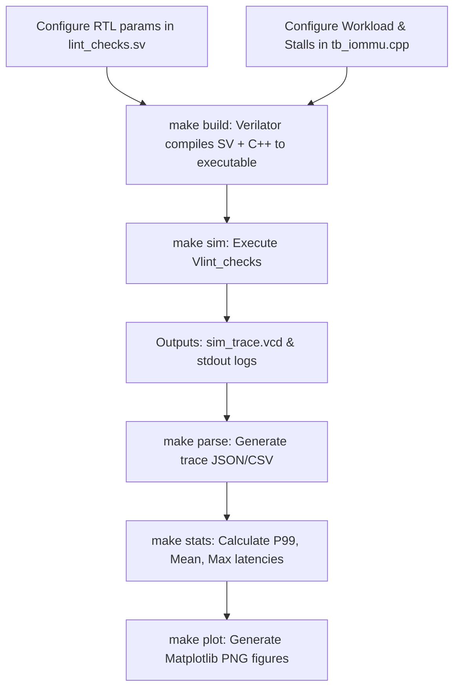

# Simulation Workflow & Methodology

This document outlines the high-level flow of running micro-architectural contention experiments in the `TempoIOMMU-RV` environment. It describes how hardware and testbench parameters are configured, and how a complete simulation cycle executes from compilation to data visualization.

---

## 1. Parameterization & Configuration

Before running an experiment, you configure two distinct sets of parameters: **Hardware Parameters** and **Testbench Parameters**.

### Hardware Parameters (RTL Configuration)
The structural capacities of the IOMMU (such as cache sizes) are configured when instantiating the module.
- **File**: `lint_checks.sv` (The top-level wrapper used for Verilator simulation).
- **Key Parameters**:
  - `IOTLB_ENTRIES`: Sets the size of the I/O Translation Lookaside Buffer.
  - `DDTC_ENTRIES`: Sets the size of the Device Directory Table Cache.
- **Example**: Changing `DDTC_ENTRIES` to `4` forces cache thrashing when 5 or more devices are active.

### Testbench Parameters (Workload & Contention Modeling)
The traffic patterns and interconnect behaviors are modeled in software.
- **File**: `tb_iommu.cpp` (The Verilator C++ testbench).
- **Key Parameters**:
  - **Workload Generation**: The `exp_stage` loop is programmed to interleave requests across various virtual devices (e.g., `device_id = 10, 20, 30, 40, 50`) addressing specific memory pages (`IOVA`).
  - **Memory Contention Model**: The `DeterministicMemoryModel` class controls AXI memory responses. You can configure `base_latency_cycles` or inject a `random_stall` (e.g., 5 to 50 cycles) to simulate interconnect congestion and background GPU traffic.

---

## 2. Compilation (`make build`)

Once parameters are set, the project is compiled into an executable binary.
- We use **Verilator** to transpile the SystemVerilog RTL (e.g., `riscv_iommu.sv` and its sub-modules) into C++ models.
- Verilator links the generated hardware models with the `tb_iommu.cpp` testbench to create a fast, cycle-accurate binary named `Vlint_checks` inside the `obj_dir/` directory.

---

## 3. Execution (`make sim`)

Running `./obj_dir/Vlint_checks` launches the simulation.

1. **Initialization**: The C++ testbench resets the hardware, toggles the clock (`clk_i`), and populates the `DeterministicMemoryModel`'s internal data structures with mocked RISC-V Sv39 Page Tables and Device Contexts.
2. **Workload Injection**: The testbench asserts AXI translation requests (`dev_tr_req_i`) acting as upstream peripheral devices.
3. **Execution & Tracing**: The hardware IOMMU processes the translations. If a cache miss occurs, the IOMMU acts as an AXI master, sending read requests (`ds_req_o`) back to the testbench's memory model to perform Page Table or Device Directory walks. 
4. **Data Logging**: The testbench monitors the completion of translations (`dev_comp_resp_i`) and logs the start cycle, completion cycle, and internal state (e.g., whether a DDT walk or IOTLB hit occurred) for each transaction.

---

## 4. Trace Parsing & Statistics (`make parse` & `make stats`)

After the simulation finishes, the raw transaction data is parsed.
- A python script (`scripts/parse_vcd.py` or stdout interceptor) packages the logged transactions into structured datasets: `results/translation_trace.json` and `results/translation_trace.csv`.
- The `scripts/calc_stats.py` script consumes the JSON trace to compute critical statistical bounds:
  - **Mean Latency**
  - **Percentiles**: P50, P90, P95, P99
  - **Max Latency**: Exposes severe tail-latency execution spikes caused by contention.

---

## 5. Visualization (`make plot`)

Finally, the `scripts/plot_latency.py` script consumes the CSV trace to generate visual figures using `matplotlib`.
- **`latency_distribution.png`**: A histogram showing the frequency of different latencies.
- **`latency_by_request.png`**: A timeline of latencies per transaction, visualizing unpredictable spikes.
- **`latency_hit_vs_miss.png`**: A boxplot comparing the baseline hit latency against the massive variance of cache misses under contention.

---

## Summary Flowchart

